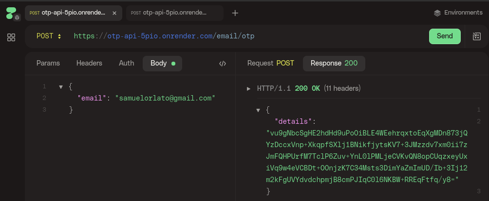
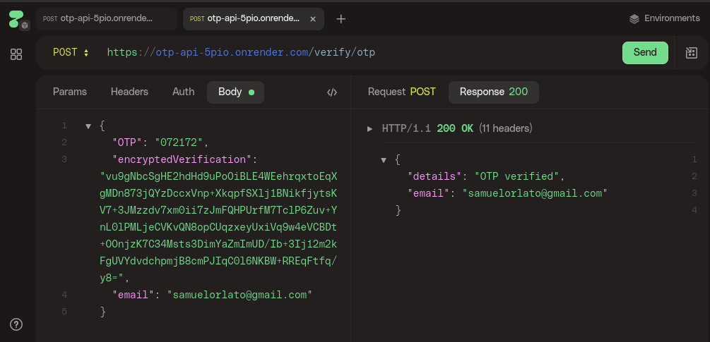

# OTP API
A Go API that sends verification code (OTP)

## Routes

 
<code>POST</code> <code><b>/email/otp</b></code> <code>(sends OTP to email)</code>

##### JSON Body Params

> | name   | type     | data type |
> | ------ | -------- | --------- |
> | email  | required | string    |

 
<code>POST</code> <code><b>/verify/otp</b></code> <code>(verifies email)</code>

##### JSON Body Params

> | name                   | type     | data type |
> | ------                 | -------- | --------- |
> | OTP                    | required | string    |
> | encryptedVerification  | required | string    |
> | email                  | required | string    |

